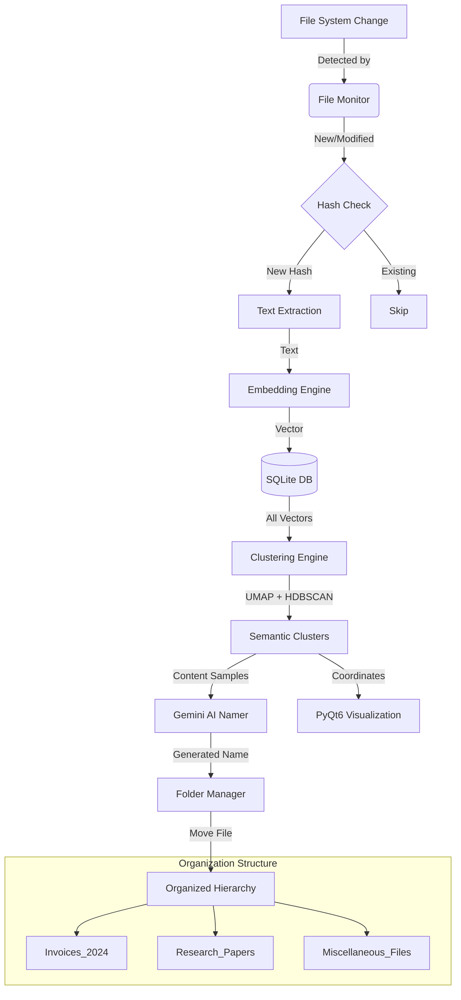

# 🧠 SEFS: Semantic Entropy File System

**SEFS (Semantic Entropy File System)** is a revolutionary file organization system that goes beyond traditional file extensions. It uses **Deep Learning** and **LLMs (Large Language Models)** to understand the actual *meaning* of your files and organize them into semantically relevant folders automatically.


---

## 🚀 Key Features

- **📂 Semantic Organization**: Files are grouped by content, not just extension. (e.g., An invoice PDF and an invoice TXT will live together).
- **🤖 AI-Powered Naming**: Uses **Google Gemini API** to analyze clusters and name folders descriptively (e.g., `Financial_Invoices`, `Project_Documentation`).
- **👀 Real-time Monitoring**: Automatically detects new, modified, or moved files and re-organizes them instantly.
- **📊 2D Semantic Map**: A beautiful graphical interface visualizing your files in a high-dimensional vector space reduced to 2D using **UMAP**.
- **🔍 Multi-format Support**: Extracts text from PDFs (OCR-style), Word Docs, Markdowns, and Plain Text.

---

## 🏗️ Architecture

The system is built on a modular "Engine" architecture:

1.  **File Monitor Engine**: Watchdog-based listener that triggers the pipeline on OS file events.
2.  **Embedding Engine**: Uses `sentence-transformers` (MPNet/MiniLM) to convert text into 768-dimensional dense vectors.
3.  **Clustering Engine**: Performs density-based clustering using **HDBSCAN** on top of **UMAP** dimensionality reduction.
4.  **AI Namer Service**: Probes the clusters using **Gemini-1.5-Flash** to distill cluster contents into a 2-3 word folder name.
5.  **Folder Manager**: Handles the safe movement and atomic updates of the file system structure.
6.  **Database Layer**: SQLite-backed persistent storage for embeddings, hashes (to prevent redundant processing), and metadata.

---

## 🔄 Workflow Diagram



---

## 🛠️ Tech Stack

- **GUI Framework**: PyQt6 (for the interactive dashboard)
- **Embedding Model**: HuggingFace `all-mpnet-base-v2` or `all-MiniLM-L6-v2`
- **Clustering**: HDBSCAN (Density-based) & UMAP (Manifold Learning)
- **AI/LLM**: Google Gemini API (Generative AI)
- **Storage**: SQLite3 with BLOB support for NumPy arrays
- **Dependencies**: `watchdog`, `sentence-transformers`, `numpy`, `scikit-learn`, `PyMuPDF`, `python-docx`

---

## 📋 Installation

1. **Clone the repository:**
   ```bash
   git clone https://github.com/your-username/Semantic-Entropy-File-System-Project.git
   cd Semantic-Entropy-File-System-Project/sefs
   ```

2. **Set up Virtual Environment:**
   ```bash
   python -m venv .venv
   source .venv/bin/activate  # On Windows: .venv\Scripts\activate
   ```

3. **Install Core Dependencies:**
   ```bash
   pip install -r requirements.txt
   pip install umap-learn hdbscan  # Required for clustering engine
   ```

4. **Configuration:**
   Create a `.env` file in the `sefs/` directory:
   ```env
   GEMINI_API_KEY=your_google_gemini_api_key_here
   ROOT_DIR=C:/Path/To/Your/Documents
   ```

---

## 🚦 Usage

Run the application:
```bash
python run.py
```

- **Select Folder**: Use the UI to pick any folder you want to organize.
- **Watch**: Files will start appearing as dots on the graph.
- **Check File Explorer**: Watch as SEFS creates folders and moves your files into semantically correct categories.

---

## 🛡️ Special Cases

- **Miscellaneous Files**: Files that don't fit into any dense cluster are automatically grouped into a `Miscellaneous_Files` folder (Noise handling via HDBSCAN).
- **Collision Prevention**: The system checks file hashes before moving to ensure no data is lost or duplicated.

---

## 👤 Author
**Supreeth Gollapally**  
*Semantic Entropy File System Project*
